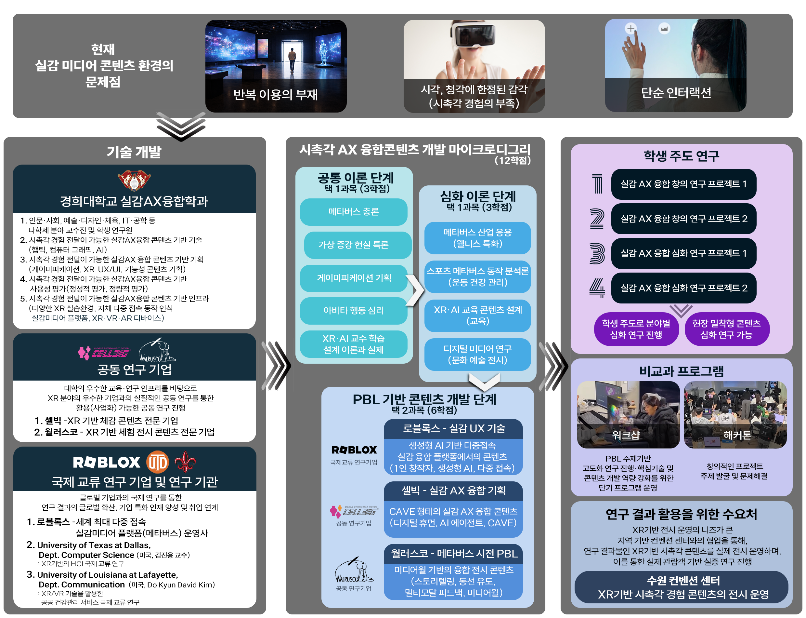
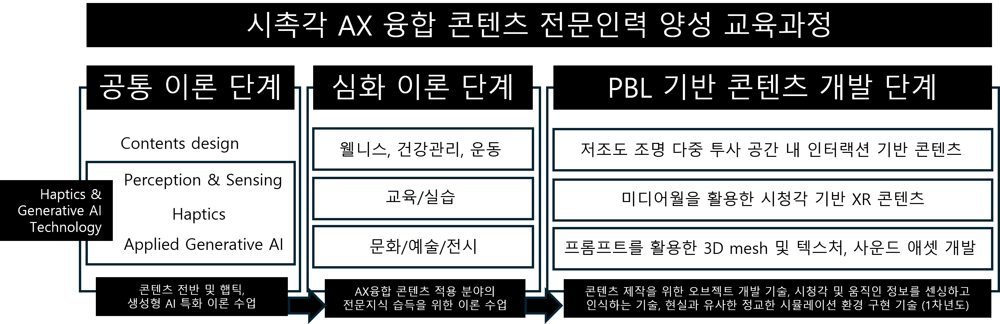
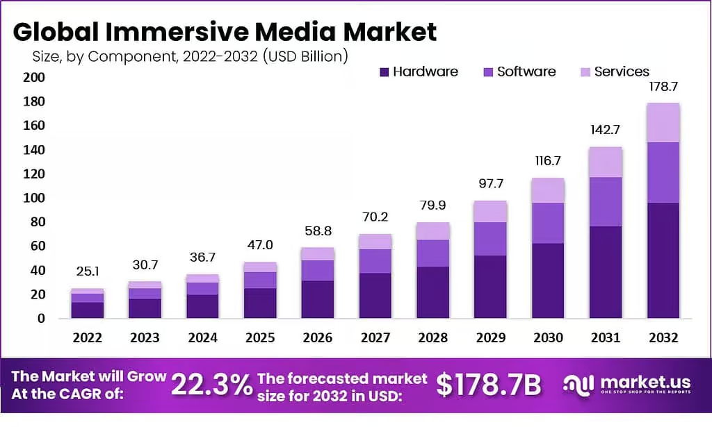
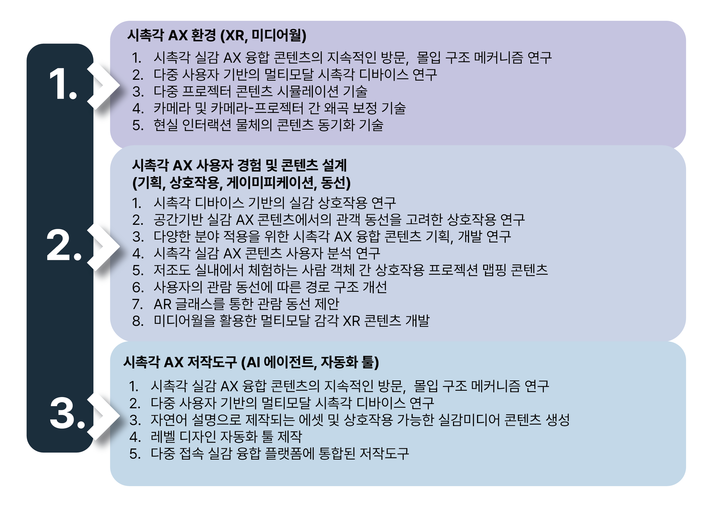
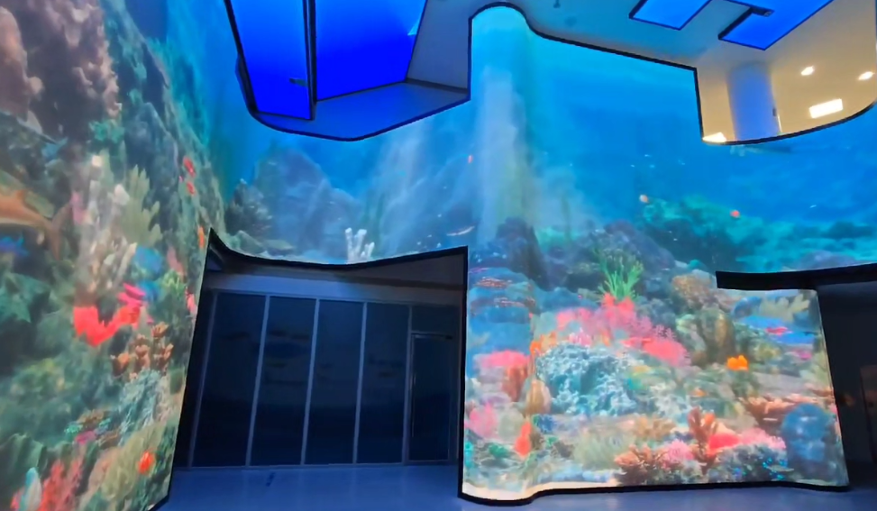
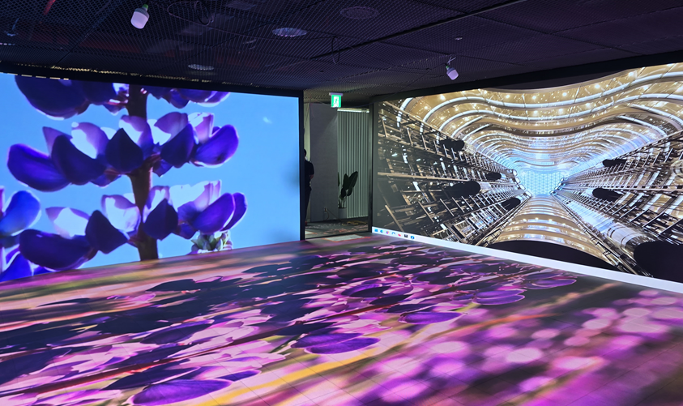

# 연구개발의 필요성

> [[KOCCA]] AX 융합콘텐츠 전문인력 양성 과제 연구개발계획서 1장 원문 인용. 표/이미지는 마크다운 표현 한계상 일부 재배치되었으나 텍스트는 원문을 그대로 보존함.
>
> **원문 대조 검증 이력 (2026-05-08)**: 1.hwpx 원문 322개 단락 / 표 11개 / 이미지 6개를 슬라이딩 윈도우 방식으로 ref 1과 대조함. 누락된 본문 없음. 다만 1-4의 「경희대학교 산학협력단」이 8명 교수의 상위 그룹 헤더로 잘못 평면화되어 있던 것을 ### 그룹 + #### 교수 구조로 수정함.
>
> **원문 표기 정정 누적 목록**:
> - 1-2 표준화 표: "SO/IEC 42001" → "ISO/IEC 42001" (오타)
> - 1-2 표준화 표: "A2A(Agnet2Agent) Protocol" → "A2A(Agent2Agent) Protocol" (오타)
> - 1-2 경쟁기관 표 팀랩 동향: "베이징, 홍콩 런던, 파리" → "베이징, 홍콩, 런던, 파리" (콤마 누락 보정)
> - 1-3 첨단기술 활용 표: "모션캡쳐" → "모션캡처" (외래어표기법 통일)
> - 본문 전반 ○ 불릿은 마크다운 `-` 불릿/헤딩으로 정규화. CLAUDE.md 규칙에 따라 가운뎃점(·)은 슬래시(/)로 대체.

## 1-1. 연구개발의 개요

*그림 01: 현재 [[실감미디어]] 콘텐츠 환경의 문제점(반복 이용 부재, 시각/청각 한정 감각, 단순 인터랙션)을 상단에 제시하고, 그 해결 방안으로 경희대학교 [[실감AX융합학과]]의 기술 개발, 시촉각 [[AX]] 융합콘텐츠 마이크로디그리(공통이론/심화이론/[[PBL]] 3단계), 학생 주도 연구, 공동 연구 기업([[셀빅]], [[월러스코]]), 국제교류 연구기관, 비교과 프로그램(워크숍, 해커톤), 연구 결과 활용 수요처를 종합 다이어그램으로 정리한 개요도.*

### AX융합콘텐츠 전문인력 양성 교육과정의 필요성

- 생성형 AI 기술 발전을 통한 콘텐츠 개발 시장의 변화
    - 기존 콘텐츠 제작 환경은 기획, 디자인, 프로그래밍의 직무 분야가 비교적 명확히 구분되는 환경 내에서 제작되었으나, [[생성형 AI]] 기술 발전을 통해 직무 구분이 사라지고 있으며, 콘텐츠 개발 경험을 통한 노하우가 개발의 중요한 포인트가 되고 있음
- 기존 실감융합콘텐츠 제작을 넘어선 다감각(시각, 청각, 촉각) 및 생성형 AI 활용 특화 영역 필요
    - 단순한 상호작용, 시각/청각 위주의 단순 경험 및 지속적 활용의 한계를 보이고 있는 기존 실감콘텐츠 제작 전문인력 양성에서 실제 현장에 적용 가능한 시촉각 경험제공이 가능한 다양한 [[XR]](Extended Reality) 환경 기반 콘텐츠와 생성형 AI 기술을 적용한 [[융합콘텐츠]] 제작 전문인력으로의 특화가 필요함
    - AI 기술 개발과 더불어 새로운 XR공간기반 및 적용 가능한 [[햅틱]] 기술 기반의 초실감(시촉각 경험) 콘텐츠 개발 및 이용 환경이 도래할 것으로 예측되므로, 기반 기술에 대한 이해와 다양한 영역으로의 적용을 위한 전문 지식 습득을 위한 과정이 필요함
- 기술 개발을 바탕으로 한 콘텐츠 개발 과정 필요
    - 상기 특화 영역으로의 확장을 위해, 현 [[실감AX융합대학원]]의 교과과정에 시촉각 경험 기반 XR공간 활용 및 생성형 AI 적용 등 최신 기술의 적용 수요가 높은 전문 기업과의 직업 매칭을 통해 PBL 교과를 구성하여, 구체적인 기술 개발 목표와 이를 활용한 콘텐츠 개발이 종합적으로 이루어질 수 있도록 해야 함

### AX융합콘텐츠 전문인력 양성을 위한 마이크로디그리 운영

*그림 02: 시촉각 AX 융합 콘텐츠 전문인력 양성 교육과정의 3단계 구조도. 공통 이론 단계(Contents design / Perception & Sensing / Haptics / Applied Generative AI)에서 햅틱과 생성형 AI 특화 이론을, 심화 이론 단계(웰니스 건강관리 운동 / 교육/실습 / 문화/예술/전시)에서 적용 분야 전문지식을, [[PBL]] 기반 콘텐츠 개발 단계(저조도 조명 다중 투사 공간 인터랙션 / 미디어월 활용 시청각 XR / 프롬프트 활용 3D mesh, 텍스처, 사운드 애셋)에서 실제 콘텐츠 제작 기술을 습득하도록 단계별로 연결한 개념도.*

- 실감AX융합대학원의 교육과정에 "시촉각AX융합콘텐츠개발" 특화 [[마이크로디그리]] 개발
    - 경희대학교 일반대학원 실감AX융합학과의 교육과정의 개설 과목으로 구성된 특화 마이크로디그리 개발로, 석/박사 전문인력의 전문성을 공고히 하며, 새로운 콘텐츠 제작 및 이용 환경의 필요 인력 공급
    - 공통 이론 단계는 콘텐츠 개발과 이해를 위한 이론 학습과 시촉각 경험 전달을 위한 햅틱 및 생성형 AI와 관련된 기술 및 응용을 위한 이론 수업을 진행함 (3학점)
    - 심화 이론 단계는 겸직 및 참여학과의 교수진을 필두로 한 웰니스, 건강관리, 운동, 교육/실습, 문화/예술/전시 등의 실감융합콘텐츠 적용 분야의 전문 지식을 습득할 수 있는 이론 수업으로 구성됨 (3학점)
    - 공통 및 심화 이론 학습 후, 실제 수요 기업(공동연구기관 2기업, 국제교류연구 1기업)과의 공동운영을 통해 PBL 기반 콘텐츠 개발 단계 교과목을 수강하여, 이론의 적용과 특화된 콘텐츠 구현 기술을 개발하고, 이를 이용한 콘텐츠를 완성품으로 제작하는 학습 진행 (6학점)

#### 시촉각 AX 융합 콘텐츠 마이크로디그리 교과과정

| 순번 | 단계 | 이수조건 | 교과목명 | 개설대학 | 학점 | 비고 |
|---|---|---|---|---|---|---|
| 1 | 공통이론단계 (택 1) | 전공선택 | 메타버스총론 | 경희대 | 3 |  |
| 2 | 〃 | 전공선택 | 가상증강현실특론 | 경희대 | 3 |  |
| 3 | 〃 | 전공선택 | 게이미피케이션기획 | 경희대 | 3 |  |
| 4 | 〃 | 전공선택 | 아바타행동심리 | 경희대 | 3 |  |
| 5 | 〃 | 전공선택 | XR-AI교수학습설계이론과실제 | 경희대 | 3 |  |
| 6 | 심화이론단계 (택 1) | 전공선택 | 메타버스산업응용 | 경희대 | 3 |  |
| 7 | 〃 | 전공선택 | 스포츠메타버스동작분석론 | 경희대 | 3 |  |
| 8 | 〃 | 전공선택 | XR-AI교육콘텐츠설계 | 경희대 | 3 |  |
| 9 | 〃 | 전공선택 | 디지털미디어연구 | 경희대 | 3 |  |
| 10 | PBL기반 콘텐츠 개발단계 (택 2) | 전공선택 | 실감UX기술(PBL) | 경희대 | 3 | 로블록스 |
| 11 | 〃 | 전공선택 | 실감AX융합기획(PBL) | 경희대 | 3 | 셀빅 |
| 12 | 〃 | 전공선택 | 메타버스실전PBL(PBL) | 경희대 | 3 | 월러스코 |

- 구성 과목수 12과목 (36학점), 이수 과목 수 4과목 (12학점)
    - 석/박사 과정의 졸업 이수 학점 석사 24학점, 박사 36학점을 감안할 때, 마이크로디그리 이수학점이 높은 편이나, 특화 영역 마이크로디그리 운영을 위해 필수적
    - 실감AX융합학과 외 타 대학원 학과에서 해당 마이크로디그리 이수를 원하는 학생이 있을 경우, 대학원 학과 내 학점교류 규정을 적용하여 진행 예정

#### 시촉각 AX 융합 콘텐츠 [[비교과]] 과정

- 워크숍, 해커톤 (학기당 1회)
    - 마이크로디그리 기반의 교과 과정 외, 비교과 과정을 통해 실습 역량을 강화할 수 있는 워크숍 및 해커톤을 학기당 1회 운영함
    - 워크숍은 4-5일의 과정을 진행하여, 간단한 콘텐츠 기획에서 개발까지의 전 과정을 학습할 수 있게 운영하며, 해커톤은 1일로 진행되는 창의적인 제작 활동으로 운영됨

### 인력양성 계획

- 120명의 수혜 인원 및 마이크로디그리 이수 졸업인원 30명 (3차년도 합계)

| 구분 | 1차년도 | 2차년도 | 3차년도 | 합계 |
|---|---|---|---|---|
| 수혜인원 | 30명 | 40명 | 50명 | 120명 |
| 졸업인원 | 10명 | 10명 | 10명 | 30명 |

## 1-2. 연구개발 대상의 국내외 현황

### 기술 현황

| 기술명 | 세부 내역 |
|---|---|
| [[LiDAR]] 센서 기술 | 고정형 LiDAR 센서를 통해 공간 내 인물 트래킹, 벽면 터치와 같은 인터랙션 도구로 활용 AI를 활용해 객체의 속성(사람, 사물, 장애물 등)을 실시간으로 분류 |
| [[XR]] 환경에서의 인터랙션 기술 | 보편화된 시선 추적(Eye Tracking), 손 추적(Hand Tracking) 기술 고해상도 카메라로 외부를 보면서 가상 인터페이스를 조작하는 패스스루(Pass-through) 기반 혼합 인터랙션([[MR]], Mixed Reality) |
| [[햅틱]] 기술 | 진동, 온열감, 역감 등을 재현하는 웨어러블 기기 연구 |
| [[생성형 AI]]를 통한 3D 자산 생성 | 텍스트 프롬프트만으로 최대 720p 24fps의 인터랙티브 3D 환경을 즉석에서 구축하는 AI 모델 Genie 3.0와 같은 AI 모델, NVIDIA AI Blueprint 등 서비스 존재 |
| Manus VR Glove | 25DOF(Degree Of Freedom)와 촉각 피드백을 통해 [[VR]] 콘텐츠, AI 훈련을 위한 가상 손 모델 구현 첨단 자기장(EMF) 트래킹 기술 기반 밀리미터 단위의 정확도와 보정 기능 제공 |

### 시장 현황

*그림 03: market.us 자료. Global Immersive Media Market의 2022~2032년 component별(Hardware/Software/Services) 시장 규모 stacked bar chart. 2022년 $25.1B에서 2032년 $178.7B로 성장 예측, CAGR 22.3%.*

[[VR]], [[AR]], 미디어아트를 활용한 실감형 콘텐츠와 AI 기반 도슨트 서비스는 이미 [[실감미디어]] 시장의 필수 요소로 자리잡았다. XR 인터랙션 기술을 통해 관람객이 가상 공간의 객체와 직접 상호작용하는 능동적 경험이 각광받고 있다. 특히 햅틱 디바이스의 도입은 시청각 정보에 의존하는 오늘날의 전시에 비해 깊이 있는 몰입감을 제공할 수 있다. LiDAR 센서 기술은 움직임을 감지하여 새로운 형태의 예술 작품을 창작해내는 데에도 사용되며, 관람객의 위치와 동선을 추적에 반응하는 인터랙티브 아트 구현의 핵심 기반이 된다. 반면 여전히 국내의 많은 온/오프라인 실감미디어 콘텐츠는 단조로운 인터랙션 위주로 진행되는 경우가 많기 때문에 새로운 환경에서의 콘텐츠 기획, 개발을 위한 노력이 필요하다.

### 경쟁 기관 현황 및 예측

| 구분 | 기관/기업명 | 동향 |
|---|---|---|
| 국내 | 버넥트 (Virnect) | XR 콘텐츠, 원격 업무, [[디지털 트윈]] 제작, 시설관리 및 공장 등 산업 별 맞춤 XR 솔루션 제공 AI기반 LLM 솔루션 출시, CES2025 혁신상 수상 |
| 국내 | 맥스트 (Maxst) | 자체 AR SDK (MAXST AR SDK)를 제공하는 AR 플랫폼 개발 및 운영 AR 원격지원, AR 저작도구 등 AR 솔루션 제공 |
| 국내 | 스마일게이트 (Smilegate) | 80여 종의 게임 타이틀을 보유한 VR 게임 서비스 플랫폼 STOVE VR 운영 |
| 국외 | 팀랩 (Teamlab) | 일본 도쿄를 중심으로 뉴욕, 베이징, 홍콩, 런던, 파리 등 다양한 미디어아트 콘텐츠 제작 프로젝션 매핑, 사이니지, 미디어 파사드 등을 전문적으로 제작 |
| 국외 | 스컬맵핑 (Skullmapping) | 3D 프로젝션 맵핑과 획기적인 스토리텔링이 강점, 제작 콘텐츠는 "르 쁘띠쁘 셰프(Le Petit Chef)" 홀로그램, VR 가상현실 등 뉴미디어 기술을 접목하여 비주얼 강점을 가진 벨기에 아트 스튜디오 |

### 지식재산권 현황

| 지식재산권명 | 지식재산권출원인 | 출원국/출원번호 |
|---|---|---|
| XR 프로덕션 시스템 적용을 위한 3D 배경 생성 저작도구 설계 방법 | 한국전자기술연구원 | 1020230168836 |
| 사용자 참여 기반의 미디어월 서비스 운영 시스템 | 와우하우스 주식회사 | 1020230024697 |
| 인터렉티브 미디어 월 시스템 및 인터렉티브 미디어 월 시스템에서의 3차원 객체 디스플레이 방법 | 주식회사 미디어프론트 | 1020150081416 |
| XR기반 인터랙티브 디지털 역사 문학관 시스템 및 방법 | 주식회사 알쥐비메이커스 | 1020220129637 |
| 인공지능 모델을 이용하여 게임 캐릭터에 적용되는 에셋을 생성하는 전자 장치 및 그의 동작 방법 | 주식회사 컨샐러드 | 1020240014387 |
| 다중 사용자 인터랙티브 [[미디어월]] | Disney Enterprises, Inc. | US 2016/0232878 A1 |

### 표준화 현황 및 예측

| 표준화 번호 | 내용 |
|---|---|
| ISO/IEC 42001 | AI 표준화, 인공지능경영시스템 인증제도로 AI를 윤리적으로 관리하기 위한 국제 표준 |
| ISO 9241-940 | 촉각 상호작용 소프트웨어 및 하드웨어의 평가를 다루는 햅틱 인터페이스 기술 표준화 |
| A2A(Agent2Agent) Protocol | Google에서 발표한 AI 에이전트간의 통신 표준화를 위한 개방형 프로토콜 |

> 원문 표기 정정: 원문에는 "SO/IEC 42001", "Agnet2Agent"로 표기되어 있으나 명백한 오타로 판단되어 각각 "ISO/IEC 42001", "Agent2Agent"로 수정함.

## 1-3. 연구개발의 중요성(필요성)

### 기술적, 경제적 가치

> 원문에서 [그림 04]는 "공동 연구를 통한 기술 발전" 행 안에 삽입돼 있으나, 마크다운 표현 한계로 표 직전에 배치함.

*그림 04: 연구개발 기술을 3개 그룹으로 정리. (1) 시촉각 AX 환경(XR, 미디어월) — 지속 방문/몰입 구조 메커니즘, 다중 사용자 멀티모달 시촉각 디바이스, 다중 프로젝터 시뮬레이션, 카메라-프로젝터 왜곡 보정, 현실 인터랙션 물체 동기화 등 6개 항목. (2) 시촉각 AX 사용자 경험 및 콘텐츠 설계(기획, 상호작용, 게이미피케이션, 동선) — 시촉각 실감 상호작용, 공간기반 관객 동선 상호작용, 다양한 분야 적용 시촉각 융합 콘텐츠 기획, 개발, 사용자 분석, 저조도 실내 사람 객체 간 매핑 콘텐츠, 관람 동선 경로 구조 개선, AR 글래스 동선 제안, 미디어월 멀티모달 감각 XR 콘텐츠 등 8개 항목. (3) 시촉각 AX 저작도구(AI 에이전트, 자동화 툴) — 멀티모달 시촉각 디바이스 연구, 자연어 설명 기반 에셋, 상호작용 실감미디어 콘텐츠 생성, 레벨 디자인 자동화 툴 제작, 다중 접속 실감 융합 플랫폼 통합 저작도구 등 5개 항목.*

| 가치 | 세부 내역 |
|---|---|
| 인재 양성 | 마이크로디그리 과정에서 기초이론-심화이론-PBL 실습으로 이어지는 단계별 교육 체계를 구축하여, 실감 AX 융합 콘텐츠의 설계/개발 역량을 갖춘 전문인력을 양성함 특히, 경희대학교는 실감AX융합학과 체계에 참여하는 다양한 전공 교수진의 커리큘럼을 반영하여, 학생들이 기술/기획/콘텐츠 응용 중 자신의 전문성을 선택/확장할 수 있는 교육 구조를 제공함 생성형 AI 기반의 창작 지원 연구를 통해, 개인의 프로그래밍 숙련도에 의존하지 않고도 아이디어 중심의 고품질 콘텐츠 제작이 가능하도록 지원하여 융합형 창작 인재를 양성함 |
| 분야별 특화 콘텐츠 개발 교육 | 웰니스, 운동/건강관리, 교육/실습, 문화/예술/전시의 4대 중점 산업 적용 분야 중심으로 이론 교육을 세분화하여 각 분야에 맞는 체계적 학습을 구성함 이론 수업 이후에는 학생들이 원하는 분야의 콘텐츠를 PBL 수업을 통해 제작할 수 있도록 지원 PBL 수업은 본 과제에 참여하는 기업의 전문가가 참여하여 콘텐츠 완성도를 높임 PBL 수업 이후, 학생주도연구를 통해서 해당 주제에 대한 심화 연구를 진행, 실무 능력 뿐만 아니라 연구적 역량 또한 높임 |
| 공동 연구를 통한 기술 발전 | 참여기업과의 공동연구를 통하여 실제 산업에서 사용되거나 필요한 기술을 중점적으로 개발 (원문 [그림 04] 위치 — 위 이미지 참조) 개발된 기술은 PBL 수업의 콘텐츠 제작에 이용되며, 개발된 기술 및 콘텐츠의 실효성 증빙을 위해 사용성 평가를 진행 기업에서 사용될 수 있는 수준의 최신 기술을 학생들이 직접 사용함으로써 첨단 기술 기반 콘텐츠 제작 경험을 보유한 인력으로 성장 가능 |
| 첨단 기술 활용 | 경희대학교는 국내 최고 수준의 실감미디어 관련 장비 및 공간을 보유 XR 기반의 CAVE, U자형 미디어월, 바닥면을 포함한 고몰입형 LED 미디어월 등 전시와 인터랙션에 특화된 실습/연구/실증 공간과 다수의 VR, AR, XR, 햅틱, 바이오센싱, [[모션캡처]] 장비들을 보유 게임, 전시 등 다양한 실감미디어 콘텐츠 제작 경험을 보유한 참여기업과의 협업을 통해, 실제 구현 가능한 기술을 중심으로 교육/연구를 수행함 다양한 생성형 AI을 활용하여(AI Agent 등) 공학 전공자가 아닌 학생도 콘텐츠 제작에 참여할 수 있도록 지원함으로써 다학제 융합형 실감 AX 인력 양성 모델을 제시함 |
| 고용 창출 및 사업화 | 본 과제를 통해 양성된 석/박사 인력은 게임/전시/XR/AI 등 첨단 콘텐츠 분야 기업, 연구소 등으로의 취업 연계가 가능함 참여 기업과의 공동 연구 및 PBL 결과물은 기술 고도화, 상용 서비스 개발 등에 활용될 수 있음 프로젝션 매핑 영상 인식 콘텐츠, 기술 솔루션 판매 학생 결과물 중 우수 콘텐츠는 기업, 학교, 정부에서 진행하는 콘테스트 및 학생 창업 지원 생성형 AI 기반 콘텐츠 제작 역량을 보유한 인력 양성을 통해, 1인 창작자 및 소규모 팀 중심의 창업 가능성을 확대하고 콘텐츠 산업 전반의 진입 장벽을 완화함 장기적으로 실감 AX 융합 콘텐츠 전문인력 풀을 확보함으로써, 관련 산업 분야의 지속적인 인재 양성과 콘텐츠 산업 생태계 활성화에 기여할 수 있을 것으로 기대됨 |

### 국내외 현황 및 문제점과 전망 / 국내 연구개발의 필요성

| 구분 | 항목 | 내용 |
|---|---|---|
| 국내외 현황 | — | AI 기술과 결합하여, 박물관, 팝업스토어 등 전시/마켓팅 영역을 넘어 산업 전반의 핵심 동력으로 확장 국내: 버추얼 프로덕션 산업을 선도, 전시/홍보 등의 마켓팅 분야나 미디어아트 등의 예술 분야에서 활용 해외: AI 기반의 정교한 시뮬레이션 제작(의료, 국방), 높은 품질의 XR, VR 콘텐츠 생산 |
| 문제점 | 단순 인터랙션 | 인터랙션 구현 수준이 단순 터치, 드래그 수준으로 단조로운 형태가 대다수임 분야와 사용 기술에 맞춰 유연한 인터랙션 디자인이 필요 |
| 문제점 | 일회성 콘텐츠 | 대부분의 실감미디어 콘텐츠는 지속적인 사용이 아닌 단발성 이용 콘텐츠 형태 지속적 몰입 구조와 반복 이용을 위한 사용성 설계가 필요 |
| 문제점 | 현실적인 촉각 경험 부족 | 현재 사용되는 감각 경험은 시각과 청각이 대다수 현실적인 경험을 위해선 햅틱 기술이 활용된 촉각 경험이 필요 |
| 문제점 | 비효율적인 AI 기술 활용 | 생성형 AI 기술 보급으로 인한 콘텐츠 제작 난이도 감소에도 불구하고 비효율적으로 사용 AI 도출 결과를 온전히 활용하기 어려움 텍스트 프롬프트 작성 및 내용 이해과정에서 어려움을 겪기도 함 |
| 문제점 | 기획/생산 인재 부족 | 실감미디어 콘텐츠를 전문적으로 기획/생산할 수 있는 인재가 부족 생애 AI 교육을 위한 전문 인력 부족(기술과 문화가 융합된 인재 부족) |
| 전망 | — | 실감미디어와 AI는 시공간의 제약을 허물고, 불필요한 비용을 절감할 수 있는 미래 산업의 핵심 국내 교육계는 단순 기술 전수를 넘어서, AI와 실감 기술을 융합하여 새로운 부가가치를 창출할 수 있는 융합형 인재 양성에 집중해야 함 |

### 정부 정책과의 연관성

| 정부 정책 |   | 과제 연관성 |
|---|---|---|
| 과학기술 인재 강국 및 AI 인재 확보 | ➡ | [마이크로디그리 과정 개발과 운영] 콘텐츠 제작 기술 특허 출원, 소프트웨어 저작권 등록 등을 적극적으로 지원하여 국내 독립 기술 확보에 기여함 - 피지컬 AI 기술 및 활용 콘텐츠 제작을 위한 전문인력 양성을 목표로 하는 마이크로디그리 개발 및 운영 |
| 첨단산업특성화대학원 운영 | ➡ | [구체적인 기술 개발 목표를 기업과 함께 달성하는 PBL교과] PBL 중심의 콘텐츠 제작 교과목을 통해 실무 인력 수급 불균형을 해소하고, 글로벌 기술 경쟁력을 확보함 |
| 여성 SW/공학 인재 양성 | ➡ | [워크숍, 해커톤 등의 비교과 과정의 확대] SW여성인재 수급 활성화 사업, 여성공학인재양성(WE-UP) 사업과 같은 여성 대상 맞춤형 교육과 취업 연계를 통해 기술 분야 여성 인재를 양성함 |

### 국가개발사업의 근거 법령 및 추진계획과의 부합성

| 근거 법령 및 추진 계획 |   | 과제 부합성 |
|---|---|---|
| 문화산업진흥 기본법 | ➡ | 문화콘텐츠, 공연/전시, 문화기술 등의 전문인력/창업양성 프로그램 개발과 운영 |
| 제 4차 문화기술 연구개발 기본계획 | ➡ | 신기술 기반 콘텐츠 산업 및 기업육성을 위한 혁신분야 선도 기술 개발과 창의인재 양성 |
| 인공지능발전과 신뢰 기반 조성 등에 관한 기본법 | ➡ | 디지털 신기술 인력양성 및 AI 기술을 활용한 콘텐츠 기획/개발 역량을 갖춘 전문인력 양성 |
| 디지털 기반 신산업 육성 정책 | ➡ | AX기반 실감형 콘텐츠 기술 연구와 인력양성 병행 구조의 과제 진행 |
| 콘텐츠 산업의 고부가가치화 전략 |   |   |

## 1-4. 선행 연구 내용 및 결과

### [[경희대학교 산학협력단]]

> 원문에서 「○ 경희대학교 산학협력단」은 아래 8명 교수의 선행연구 표 위에 그룹 라벨로 등장함. 표는 「연구자 | 선행연구 및 확보기술 등」 2열 구조이며, 각 교수는 「연구 과제 / 기술 및 저작권 / 연구 논문」 등의 카테고리별로 정리됨.

#### [[우탁]] 교수님

- **연구 과제**
    - 실감형 문화콘텐츠를 위한 사용자 맥락기반 시촉각 인터랙션 저작기술 개발
    - 2024, 2025 용인특례시 미래기술학교 운영 지원 사업
    - 고몰입을 위한 CAVE 시스템의 사용자 반응형 XR 콘텐츠 및 인터페이스 연구
    - [[메타버스]] 융합대학원
- **기술 및 저작권**
    - 가야금 콘텐츠 in VIVEN, 요리 콘텐츠 in VIVEN, VIVEN for Haptic (소프트웨어 등록)
    - Vlog 안드로이드, 교육용 CAVE 기반 몰입형 협동 경쟁 스포츠 시스템, CAVE 시스템을 활용한 XR 환경이 적용된 방 탈출 형식의 미니게임 (소프트웨어 등록)
    - 가상 객체를 선택하는 전자 장치 및 그 동작방법 (특허 출원)

#### [[전석희]] 교수님

- **연구 과제**
    - Realistic Media COSS Project
    - Development of tactile standards and high-fidelity integrated haptic system for the realization of a hyper realistic metaverse
    - Generative Haptics and Fine Response Inference for Flexible Tactile Interfaces
    - Non-Wearable Visuo-Haptic Digital Twin Interface Platform for Displaying Multi-Modal Information of Digital Objects
    - Development of a global multiverse platform for sharing senses and experiences between humans and avatars
- **기술 및 저작권**
    - Apparatus, system, and method for generating haptic texture (10-2679887)
    - Apparatus and method for haptic texture prediction (10-2756642)
    - Emotion delivering through vibrotactile feedback (10-2049838)
    - Apparatus and method for supporting tactile texture model-based remote control (10-2756643)
    - Apparatus and method for generating collision acceleration profile (10-2834754)

#### [[이상민]] 교수님

- **연구 논문**
    - Self-regulated speaking with AI-empowered NPCs in VR.
    - Toward Trustworthy AI in Education: Stakeholders' Risk Perceptions in Korea's AI Digital Textbook Implementation
    - Trends in Cultural Technologies With AI-XR Integrated Kinetic Media
    - 생성형 AI를 활용한 맞춤형 영어 읽기 자료 생성: 중등 교육과정 기반 GPT 모델 개발을 기반으로

#### [[이신영]] 교수님

- **연구 과제**
    - 초고해상도 기가픽셀 3D 데이터 생성 기술 개발 (참여연구원)
    - 사운드 기반 포토리얼리스틱 3D 페이스 생성 기술개발 (참여연구원)
    - 초실감 디지털 휴먼 재현을 위한 편광 기반 4차원 시공간 모델 획득 및 렌더링 기술 개발 (참여연구원)
- **기술 및 저작권**
    - 환경 조명 형태의 시각 컨텐츠의 안정적인 보간 계산을 위한 편광 매개변수 표현 이론 및 기술
    - 사실적 광원 효과의 실시간 렌더링을 위한 진동수 도메인 근사 이론 및 기술
    - 현실 기반 시각 컨텐츠 취득을 위한 미분가능 렌더링 시스템 기술

#### [[김정현]] 교수님

- **연구 과제**
    - 실감형 장애인 스포츠 콘텐츠 활성화 방안 연구
    - 햅틱 피드백 증강을 통한 척수손상자 감각-운동 통합 향상 연구
    - XR 기반 고유 감각 운동 중재의 하지 공간 지각 능력 향상 효과 연구
- **기술 및 저작권**
    - 인간 대상자 기반 디지털 콘텐츠 운동량 및 신체활동 효과성 평가 기술
    - 전문 스포츠 선수 대상 디지털 트윈 생체/경기력 정보 표출 프로토콜 설계 기술
    - 마라토너를 위한 운동 부하 검사 정보 제공 시스템 및 그 방법 (특허 등록)

#### [[이원구]] 교수님

- **연구 과제**
    - A simplified morse-coded eyewear-type transducer for touchless communication via complex head gestures (Sensors & Actuators A Physical 2025)
    - A human cruciate ligament-mimic crossed four-bar linkage actuator for reconstructing mixed reality gait under multiphase flow pressure (S&A A Physical 2025)
    - A hybrid upper-arm-geared exoskeleton with anatomical digital twin for tangible metaverse feedback and communication (Advanced Materials Technologies 2024)
    - Metaverse wearables for immersive digital healthcare (Advanced Science 2023)
    - Mixed Reality Knee Health Unit (교육부장관상 수상, 2023)
    - Active Resistance Mechanism for Overuse Rehabilitation (산업통상부장관상 수상, 2025)
- **기술 및 저작권**
    - METAVERSE INTERFACE DEVICE (10-2866095, 특허등록 2025)
    - HAND TREMOR ASSISTANCE APPARATUS AND METHOD THEREOF (10-2907423)

#### [[이원희]] 교수님

- **연구 과제**
    - AI 기반 뇌 상태/생체신호 예측 알고리즘 개발 연구
    - AI 및 데이터 기반 실감형 콘텐츠 분석 및 설계 연구
    - 실감 콘텐츠 사용자 경험 향상을 위한 HCI/데이터 연구
- **기술 및 저작권**
    - 멀티모달 신경/건강 데이터 기반 예측 모델 설계 및 개발 기술
    - 감정 및 생체신호 데이터를 활용한 사용자 경험 정량화 및 평가 지표 개발 기술
    - 실감콘텐츠 UX 및 사용자 행동 분석을 위한 AI 알고리즘 기술

#### [[오승재]] 교수님

- **연구 과제**
    - 햅틱 메타물질을 활용한 햅틱 감각 전달-제어 방법론 및 시스템 구축
    - 성공적인 교차 기기 컴퓨팅을 위한 사용자-기기 상호인식 기술
    - 촉각 센서 제작을 위한 기술 및 촉각 센터 데이터를 이용한 AI 응용
- **기술 및 저작권**
    - 햅틱 메타물질 기반 촉각 센서 제작 및 검증
    - 공압기반 자세 제어 햅틱 장갑 제작
    - AI 기반 분석 Hand-Object Interaction 분석 기술

### ㈜[[셀빅]]

- **선행연구 및 확보기술 등**
    - 단일의 모션센서를 이용한 다중 플레이어 게임 제공 방법 (등록번호 10-1527188, 출원일 2013.07.23)
    - 혼합 현실 기반의 다중 참여형 공간 어뮤즈먼트 서비스 방법 및 다중 참여형 공간 어뮤즈먼트 서비스 시스템 (등록번호 10-1966020, 출원일 2018.10.12)
    - 스케치 기반의 캐릭터를 가상환경의 활동 캐릭터로 생성하기 위한 스케치 기반의 활동캐릭터 생성 방법 (등록번호 10-2343562, 출원일 2021.12.22)

### ㈜[[월러스코]] [[디자인랩]]

- **선행연구 및 확보기술 등**
    - 실감콘텐츠 구현을 위한 스크린 구조물 (등록번호 10-2464940, 출원일 2022.08.02, 등록일 2022.11.03)
    - 4면 직각 [[미디어월]](3방향, 1바닥) 개발 및 구축
    - 곡면을 활용한 미디어월 구축

*그림 05: 곡면 미디어월에 해저, 산호초, 물고기 영상이 표시되는 전시 공간 사진. 좌우 측면과 정면을 곡면 LED로 구성한 4면 미디어월 구축 사례.*

*그림 06: 보라색, 푸른색 톤의 추상 영상이 곡면 LED와 바닥면에 동시 투사되는 미디어월 구축 사례. "곡면을 활용한 미디어월 구축" 항목의 보충 이미지로 추정(원문에 별도 캡션 없음).*
