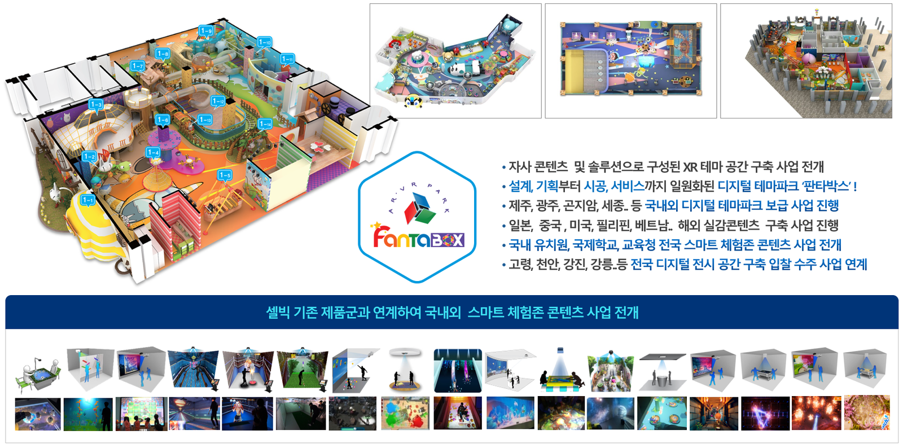
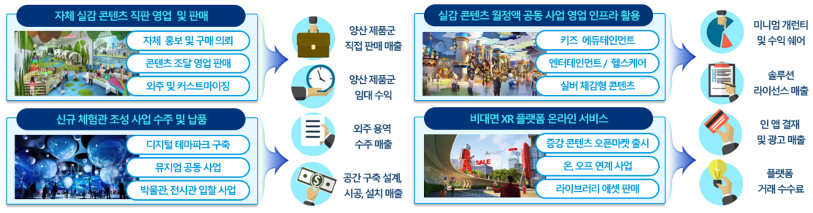
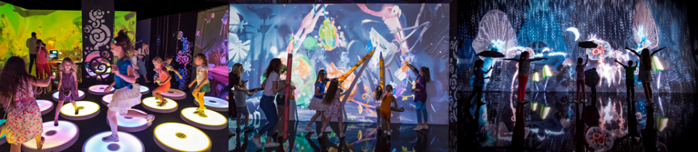
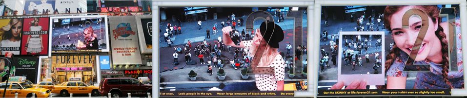
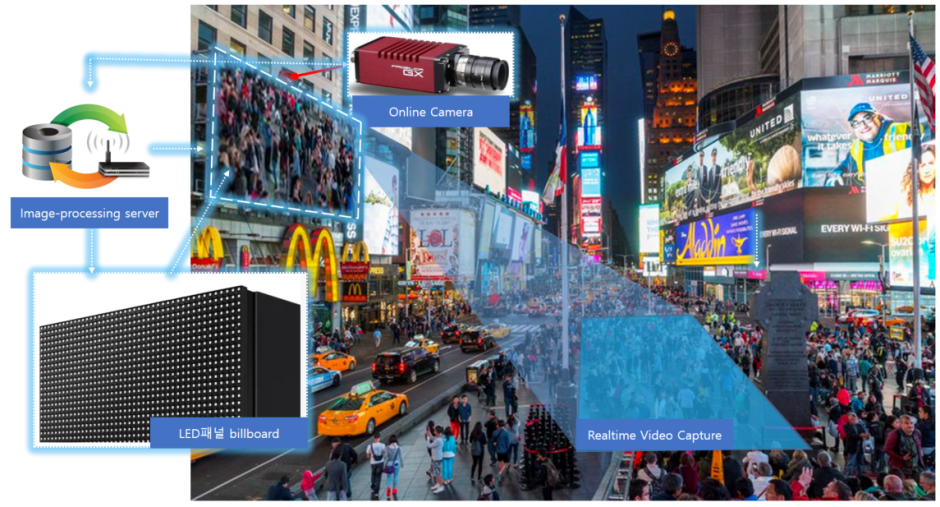
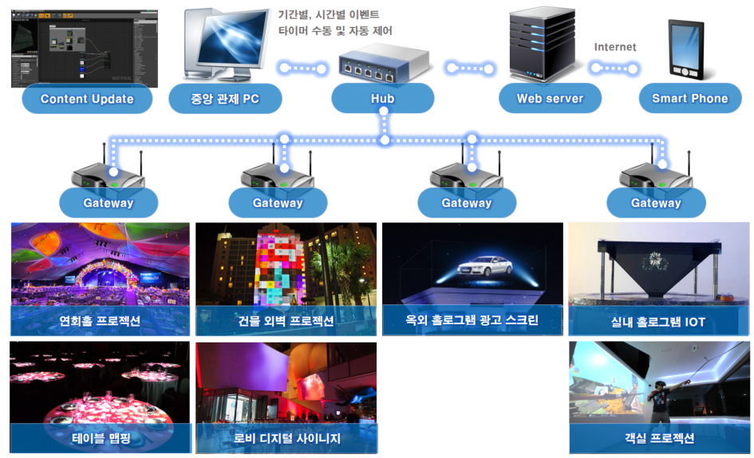
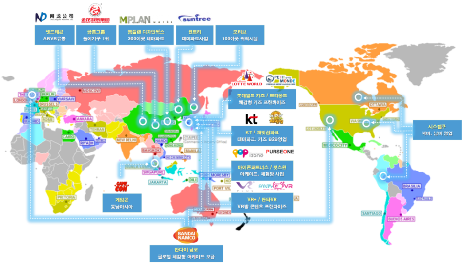
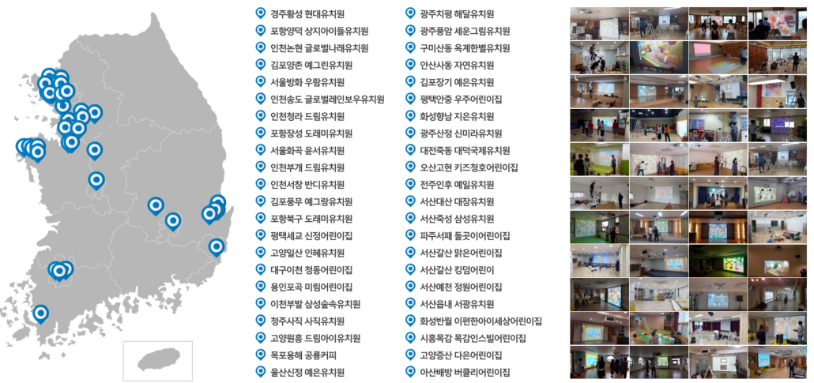

# 5. 연구개발성과의 활용방안 및 기대효과

> 본 문서는 `assets/5.hwpx`의 텍스트, 표, 이미지를 마크다운으로 옮긴 원문 사본임. 이미지는 `assets/ref5_images/` 하위 PNG 파일을 참조하며, 각 자리표시자에 시각 분석 기반 설명을 부여하였음. 후속 wiki 작업의 인용 근거로 사용.

---

## 5-1. 연구개발성과의 활용방안

본 연구개발과제를 통해 도출되는 성과는 기술 성과, 콘텐츠 성과, 인력양성 성과로 구분되며, 각 성과는 실감미디어 콘텐츠 산업 전반에 걸쳐 교육/연구/산업 현장에서 다양하게 활용될 수 있음.

### 기술적 성과의 활용
- 주관연구개발기관인 경희대학교 산학협력단과 공동연구개발기관인 ㈜셀빅, ㈜월러스코 디자인랩이 공동으로 개발한 시촉각 실감 AX 융합 기술, 다중 프로젝터 맵핑 기술, 멀티모달 XR 상호작용 기술, 자연어 기반 콘텐츠 자동 생성 기술은 전시, 게임, XR 체험 콘텐츠, 실감미디어 플랫폼 개발에 직접 활용될 수 있음
- 특히, 국제교류연구기업인 로블록스와 함께한 텍스트 프롬프트 기반 자동 에셋 생성 및 절차적 맵 생성 기술은 콘텐츠 제작 공정을 단축하고, 소규모 개발 환경에서도 고품질 콘텐츠 제작이 가능하도록 지원함

### 콘텐츠 성과의 활용
- 연구개발 과정에서 제작되는 시촉각 AX 융합 콘텐츠, 미디어월 기반 XR 전시 콘텐츠, CAVE 및 프로젝션 맵핑 기반 체험형 콘텐츠는 실증 전시, 파일럿 서비스, 기술 홍보 콘텐츠 등으로 활용 가능함
- 사용자 동선 분석과 사용성 평가를 통해, 검증된 콘텐츠 설계 결과는 후속 콘텐츠 개발을 위한 설계 가이드라인 및 매뉴얼로 정리되어 재활용 가능함
- 수원 컨벤션센터와의 협업을 통해, PBL 수업 및 연구 개발을 위해 제작된 콘텐츠를 일반인 대상으로 전시하여 시촉각 AX 융합 콘텐츠의 효용성을 확인함

### 교육 및 인력양성 성과의 활용
- 마이크로디그리 및 PBL 기반 교육을 통해 축적된 교육 운영 모델과 교과 콘텐츠는 향후 실감 AX 융합 분야의 정규 교육과정, 단기 전문 교육, 산학 연계 교육 프로그램 등으로 확장 가능함
- 본 과제를 통해 양성된 석/박사 전문인력은 참여기업, 유관 콘텐츠 기업, 연구소, 특히 로블록스 등의 국제교류기업으로 진출하여, 연구개발성과의 산업 현장 확산을 촉진하는 핵심 인력으로 활용되길 기대함

### 개발 콘텐츠를 활용한 사업화 활용 방안
- 다양한 환경에서 사용자와 실시간으로 교감하는 인터렉션 기반의 고품질 미디어아트 서비스를 통하여 교육 시뮬레이션, 체험 시뮬레이션 등에 대한 사용자의 체험의 질 향상에 기여

**[표 1] 개발 콘텐츠 수요처 분석**

| 수요처 | 국명 | 수요량 | 관련제품 |
| --- | --- | --- | --- |
| 옥외광고 협회 | 한국 | 매체 대행 2조원 규모 대상 | 증강 스크린 |
| 광고대행사 | 한국 | 디지털 사이니지 10만대 | 미러링 키오스크 |
| IPTV 사업자 | 한국 | 1,400만 가입자대상 | MUX 솔루션 |
| 전시, 박물관 | 한국 | 1,000 여곳 전시 업데이트 | 체감형 인터렉션 콘텐츠 |
| 체험존 이벤트 대행사 | 한국 | 광고제작 2조원 규모 대상 | 미디어월 |
| 영유아 사교육 업체 | 한국 | 디지털 학습 교구 1조원 대상 | 에듀테인먼트 앱 |

- 문화콘텐츠 사업 경험이 많은 셀빅의 장점을 활용하여 결과물의 상용화, 사업화 측면에 비중을 두어 결과물이 일회성 콘텐츠가 아니라 지속적인 비즈니스 모델과 결합하여 사업화할 수 있는 방향으로 설정하고 이러한 측면에서는 실적을 통해 결과물의 우수성을 증명하고자 함
- 아날로그와 디지털 환경을 넘나드는 디지로그 콘텐츠 개발에 대한 다년간의 연구 및 상업화 경험 보유
- AR-A.I, 프로젝션 매핑-센싱 등 실제 환경 기반의 다양한 디지털 기술의 융합을 통한 새로운 가치 창출에 대한 도전과 성과
- 콘텐츠 별 다양한 비즈니스 모델 구축을 통한 수익의 다각화 및 관련 경험을 보유

**[그림 29] 기존 추진중인 셀빅 추진 실적 및 체험존 콘텐츠 사업 연계 계획**

> 시각 정보 요약: 좌측에 셀빅이 구축한 대형 실내 디지털 테마파크 평면 조감도(여러 색상 구획의 체험존이 배치된 구조), 상단 우측에는 키즈 체험관/디지털 테마파크/플레이그라운드 실제 운영 사진 3장. 우측 텍스트 박스에는 사업 연계 항목 명시(기사 콘텐츠 및 솔루션으로 구성된 K-테마 공간 구축 사업 연계, 제주/광주/군지컴/세종 등 국내외 디지털 테마파크 보급 사업, 일본/중국/동남아/베트남/필리핀 해외 진출 사업, 국내 유치원·교육청 본사 사업 등). 하단에는 셀빅 기존 제품군과 연계하여 국내외 스마트 체험존 콘텐츠 사업으로 전개되는 체험존 운영 사진 그리드(미디어월, 인터랙티브 바닥, 모션 스크린 등 다수 사례).

**[그림 30] 실감콘텐츠 서비스 확장 사업모델**

> 시각 정보 요약: 4분면 박스로 구성된 셀빅의 실감콘텐츠 서비스 확장 사업모델 다이어그램.
> - (좌상) **자체 실감 콘텐츠 직영 영업 및 판매**: 콘텐츠 홍보 및 구매 의뢰, 콘텐츠 조달 영업관리, 외주 및 스트리머 마켓 → 양산 제품군 직접 판매 매출
> - (우상) **실감 콘텐츠 월정액 공동 사업 연합 인프라 활용**: 키즈 에듀테인먼트, 헬스케어, 교육 콘텐츠 → 양산 제품군 임대 수익
> - (좌하) **신규 체험관 조성 사업 수주 및 납품**: 디지털 테마파크 구축, 유치원 공동 사업, 박물관·전시관 입찰 사업 → 공간 구축 설계/시공/설치 매출
> - (우하) **비대면 XR 플랫폼 온라인 서비스**: 증강 콘텐츠 오프라인룸 출시, 온/오프 연계 사업, 라이선스 페이 판매 → 증강 콘텐츠 라이선스 매출
> - 우측 끝단 최종 수익 흐름: 미니솔 개편비/수익 배분, 솔루션 라이선스 판매, 인앱 결제 및 광고비, 전용제 거래 수익

확장 사업모델 핵심:
- 미디어월 + XR 콘텐츠 + 센서 인터랙션을 통합한 전시·체험 공간 구축 솔루션
- 전시 규모 및 예산에 따라 선택 가능한 모듈형 제품 구조
- 전시 기획–설계–구축–운영까지 포함한 원스톱 사업 모델

---

## 5-2. 기대효과

### 기술적 기대효과
- 시촉각 기반 실감 AX 융합 콘텐츠 제작을 위한 멀티모달 상호작용 기술, 공간 기반 인터랙션 설계 기술, 자동 콘텐츠 생성 기술을 확보함으로써, 실감미디어 콘텐츠 기술 수준을 고도화
- 자연어 기반 콘텐츠 생성 및 레벨 디자인 자동화 기술을 통해, 콘텐츠 개발 과정의 효율성을 향상시키고, 1인 창작자의 개발 접근성을 높여 기술 진입 장벽을 완화
- 다중 사용자 환경에서의 상호작용, 관람 동선 최적화, 사용성 평가 기반 설계 모델을 정립하여, 실감형 콘텐츠의 기술적 완성도와 재현성을 높임

### 경제/산업적 기대효과
- 본 과제를 통해 양성된 석/박사 전문인력은 게임, 전시, XR, AI 콘텐츠 산업 및 연구기관으로 진출하여, 고급 기술 인력 수요에 대응하는 핵심 인재로 활용될 수 있음
- 공동 연구를 통해 개발된 기술과 콘텐츠는 상용 서비스 개발, 기술 솔루션 판매, 전시 콘텐츠 사업화 등으로 연계되어 콘텐츠 산업의 부가가치 창출에 기여할 수 있음
- 생성형 AI 기반 콘텐츠 제작 기술을 활용한 1인 창작자 및 소규모 개발팀의 창업 가능성을 확대하여 콘텐츠 산업 생태계의 다양성과 지속성을 강화할 수 있음
- 본 연구로 개발된 다양한 산업 분야에 적용 가능한 시촉각 AX 융합 콘텐츠를 바탕으로 적극적인 참여, 수요, 국제교류기업 등의 활용을 통해, 실감 AX 융합 콘텐츠 분야를 선도할 것으로 기대됨

### 문화/사회적 기대효과
- 시촉각을 포함한 다감각 실감 콘텐츠 확산을 통해, 관람객과 사용자가 몰입도 높은 문화/전시/체험 환경을 경험할 수 있음
- 지속적인 몰입과 다회성 사용을 유도하는 콘텐츠 설계 방식을 도입한 시촉각 AX 융합 콘텐츠들의 질적 향상을 기대함
- 다학제 융합 기반 인력양성 모델을 통해, 공학/예술/인문/체육 등 다양한 전공이 결합된 융합형 인재를 양성하며, 본 과제의 수혜를 받은 학생들이 미래 콘텐츠 산업을 선도할 인재가 될 것을 기대함
- 수요기업인 수원컨벤션센터 등의 전시공간 및 공동연구기관의 사업화 콘텐츠에 연구결과를 직접 활용함으로써, 새로운 실감 AX 융합 콘텐츠 문화를 선도할 것으로 기대됨

---

## 5-3. 사업화 전략 및 계획

### [표 2] 사업화 전략 — ㈜셀빅

**사업화 모델(BM)**
- 상용화 형태: 프로젝션 매핑 영상 인식 콘텐츠, 기술 솔루션 판매
- 수요처: 미디어아트 전시, 박물관 디지털 헤리티지, 키즈 에듀테크, 디지털 사이니지, 미디어 광고시장
- 예상 단가: B2B 제품 판매 단가 800~1,300만원대 / 케이브 프로젝션 맵핑 솔루션 단가 5천만원~3억원대 예상

**사업화 추진 주체**
- ㈜셀빅

**시장분석 — 전시시장**
- 다양한 인터랙티브 기술을 활용한 새로운 전시 스타일의 유행
- 전세계적으로 미디어아트 기반 전시가 다양하게 진행됨
- 이벤트 사업, 쇼핑몰, 오피스 등의 공간설계, 광고, 디지털 사이니지, 교육 등 다양한 분야에서 적용

**[그림 26] 앨리스 인 원더랜드 전시 사진**

> 시각 정보 요약: 어두운 실내 미디어아트 전시 공간 사진 3장. (좌) 관람객들이 LED 조명이 들어오는 원형 스툴에 앉아 벽면에 투사된 다채로운 미디어아트 영상을 감상, (중) 대형 벽면에 마법적인 캐릭터·식물·동물 일러스트가 투영되고 어린이/성인 관람객들이 직접 다가가 인터랙션, (우) 거울/물 같은 표면에 반사되며 관람객 실루엣이 영상에 합성되는 몰입형 전시 환경.

**시장분석 — 광고시장**
- 디즈니와 증강현실업체 Apache의 협업은 다양한 제품의 프로모션으로 확대됨
- 미국의 SPA 브랜드인 Forever21은 인터랙션이 가능한 광고 프로모션 진행

**[그림 27] 뉴욕 타임스퀘어 전시 예시 사진** — 뉴욕 타임스퀘어에 전시된 디지털 사이니지 기술과 인터랙션 기술이 결합된 광고

> 시각 정보 요약: (좌) 뉴욕 거리의 영화 포스터 게시판(라이언킹, 포에버 등 공연/영화 광고 다수가 벽면에 부착된 모습), (중·우) 뉴욕 타임스퀘어 대형 디지털 사이니지에 카메라로 캡처된 일반 행인의 모습이 합성되어 송출되는 인터랙티브 광고 사례. 군중 사이에서 한 인물(여성)이 화면에 클로즈업되어 광고에 등장.

**사업화 전략 및 계획**
- 저조도 다인 객체 인식 플랫폼 서비스로 야간 옥외나 실내 프로모션 사업 전개

**[그림 28] AI-AR 옥외 광고 패널 시스템 / 실내 사이니지, 프로젝션 맵핑 디스플레이 통합 제어 구조도**

> 시각 정보 요약 (이미지 5 — AI-AR 옥외 광고 패널 시스템): 좌측에 LED 디스플레이 박스 + Image processing camera 모듈, 중앙에 야간 도시 거리(타임스퀘어 풍) 사진에 사람·차량 객체가 색상 박스로 자동 인식 표시, 우측에 Real-time Video Capture 화면. 즉 옥외 LED 패널에 부착된 카메라로 실시간으로 보행자/차량을 인식해 광고 콘텐츠를 동적으로 제어하는 시스템 구조도.

> 시각 정보 요약 (이미지 6 — 실내 사이니지/프로젝션 맵핑 통합 제어 구조도): 상단에 데이터 흐름 아키텍처 다이어그램(Content copyright → 운영 PC → Hub → Web Server → Smart Phone, Gateway 다중 분기), 하단에 6개의 운영 사례 사진(인터랙티브 프로젝션 맵핑, 무대형 미디어월, 매트릭스 LED 디스플레이, 홀로그램 부스, 매핑된 입체 오브젝트, 야외 미디어월). 즉 실내 미디어 콘텐츠를 중앙에서 통합 제어하는 시스템 아키텍처와 그 적용 사례.

**사업화 전략 및 계획 (계속)**
- 전국 전시, 박물관 실감형 콘텐츠 입찰 사업 참여 수주
- 삼성동 인터컨티넨털 호텔 로비 갤러리 존과 코엑스몰 팝업스토어 보행 통로 미디어아트 콘텐츠 구축 계약 협의 진행 중
- 누리교육 과정 전국 어린이집, 유아원 대상 수익쉐어 기반 '키즐' 공동 400개원 보급 완료. 향후 1,000여곳 공급 확대
- 국내 미래교실형 스마트 교육을 대표하는 유치원, 어린이집 통합프로그램 부문 1위 유엔젤 공동사업으로 진행 중
- 서비스 이용료: 원아 당 1,900원 (월별 사용료, VAT 포함) / 24개월 약정 상품 / 월매출 1억원
- B2B 주요 마케팅 방안 및 사업 계획
- 기존 판매 영업 인프라, 디지털 테마파크를 통한 신규 콘텐츠 판매

**[그림 29] 프로젝션 맵핑 기반 에듀테인먼트 콘텐츠 보급사업 / 체감형 콘텐츠 거래처 및 제휴 업체**

> 주의: 본 그림 번호 [그림 29]는 5-1절의 [그림 29]와 별개의 그림으로 원문에 동일 번호 중복 등재됨. 후속 인용 시 이미지 파일명(image7/image8)으로 구분 권장.

> 시각 정보 요약 (이미지 7 — 글로벌 체감형 콘텐츠 거래처/제휴 업체 지도): 세계 지도 위에 셀빅의 글로벌 사업 파트너 분포 표시. 한국에 NB공작/유진로보틱스/MPLAN/Suntree 등 본사 거점, 일본에 LOTTE WORLD, 미국에 PERFECT GAME/PICO, 동남아·중동·아프리카·유럽·남미 각 지역에 사업 거점/제휴 로고 다수(KT, Bandai Namco, FURSEONE, Vingroup, KFP/제일모직 등 포함). 화살표로 한국 본사에서 각 지역으로 사업 전개·진출 흐름이 표시됨.

> 시각 정보 요약 (이미지 8 — 키즐 보급 어린이집/유치원 위치 현황): 좌측에 한국 지도 위에 다수의 위치 마커(어린이집·유치원 보급 거점), 중앙에 보급 기관명 리스트 텍스트(약 40~50개의 기관명이 두 단으로 나열), 우측에 실제 어린이집 내 키즐 콘텐츠 운영 사진 그리드(약 12장). 즉 누리교육 키즐 보급 사업의 전국 분포 현황 및 운영 사례.

---

### [표 3] 사업화 전략 — ㈜월러스코 디자인랩

**사업화 모델(BM)**
- 미디어월 기반 XR 몰입형 전시·체험 공간 구축 솔루션
  - 미디어월, XR 콘텐츠, 관람 경로 가이드, 멀티모달 인터랙션을 통합한 패키지형 솔루션 사업

**사업화 추진 주체**
- ㈜월러스코 디자인랩

**시장분석**

경쟁기업 현황:
- 전시·미디어아트 전문 기업: 주로 영상 중심, XR/경로 가이드 기능 제한
- XR 콘텐츠 기업: 콘텐츠 중심, 실제 공간 통합 및 운영 경험 부족
- 시스템 통합(SI) 기업: 하드웨어 중심, 체험 시나리오 및 UX 설계 한계

시장 진입 장벽:
- 대형 미디어월 구축 및 동기화 기술 필요
- 공공 전시 실증 경험 및 레퍼런스 요구
- XR/센서/공간 설계 간 통합 역량 필요

시장 동향:
- 공공/문화시설의 체험형/몰입형 전시 수요 지속 확대
- 정적인 전시에서 관람 동선/경험 중심 전시로 전환
- 디지털 전환(DX) 정책에 따른 공공 발주 확대

**사업화 전략 및 계획**

차별성 전략:
- XR 콘텐츠와 관람 경로 구조를 결합한 능동형 전시 시스템
- 다중 사용자 환경을 고려한 실증 기반 설계
- 운영 매뉴얼까지 포함한 완성형 전시 솔루션

경쟁우위 확보 방안:
- 연구개발 실증 결과를 기반으로 한 기술 신뢰성 확보
- 모듈형 설계를 통한 다양한 전시 공간 대응
- 공공/문화 분야 다수 구축 경험 기반 수주 경쟁력 강화

수익 창출 방안:
- 전시 공간 구축 계약 (설계, 시공, 콘텐츠)
- 유지보수 및 콘텐츠 고도화 계약
- 후속 확장 콘텐츠 추가 공급

사업화 전략 핵심 요약:
- ('28년) 연구성과 기반 솔루션 패키지화
- ('29년~) 공공/문화시설 대상 본격 사업화 추진
