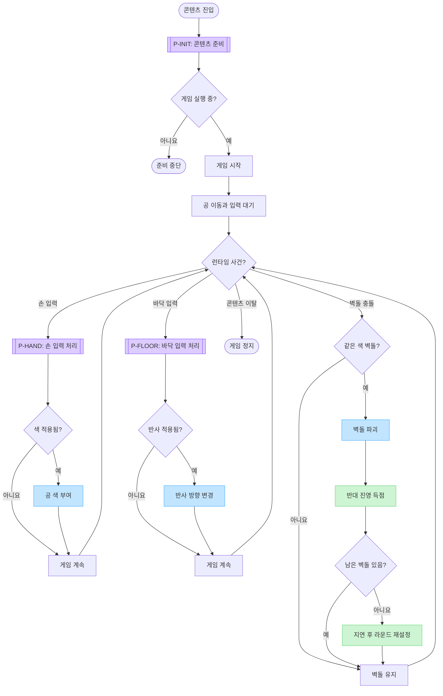
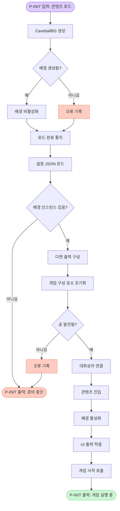
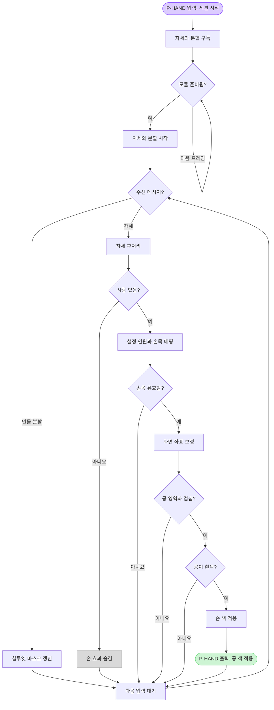
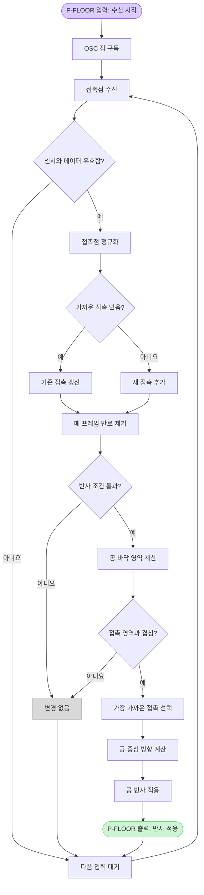

> CaveBall의 실행 구조를 핵심 게임 플로우와 세 개의 사전 프로세스로 분리한 문서임. 핵심 플로우는 사용자 경험과 게임 규칙만 보여 주고, 콘텐츠 준비, 손 입력 처리와 바닥 입력 처리는 같은 계약 ID를 가진 별도 Mermaid 흐름도로 연결함. 코드 근거와 정적 분석의 한계는 [[CaveBall 클라이언트 코드 구조 분석]]을 따름.

# 1. 핵심 게임 플로우

핵심 플로우는 게임이 실행된 뒤 반복되는 사건과 결과만 표시함. 이 흐름에 입력을 공급하는 준비 과정은 호출형 노드로 접어 둠.

## 1.1 사전 프로세스 연결 계약

핵심 플로우의 보라색 호출형 노드는 아래 상세 절과 연결됨. Mermaid 렌더러마다 클릭 링크 지원이 달라 문서 anchor를 정본 연결로 사용함.

| 계약 ID | 상세 플로우 | 입력 | 핵심 플로우로 돌려주는 결과 |
|---|---|---|---|
| `P-INIT` | [[#2. 사전 프로세스 A 콘텐츠 준비]] | 콘텐츠 로드와 진입 호출 | 게임 실행 중 또는 준비 중단 |
| `P-HAND` | [[#3. 사전 프로세스 B 손 입력 처리]] | 자세 추정 또는 인물 분할 메시지 | 공 색 적용 또는 변경 없음 |
| `P-FLOOR` | [[#4. 사전 프로세스 C 바닥 입력 처리]] | OSC 바닥 접촉점 | 공 반사 적용 또는 변경 없음 |

근거 범위는 [[CaveBall 클라이언트 코드 구조 분석#4. 실행 흐름]]임.

# 2. 사전 프로세스 A 콘텐츠 준비

`P-INIT`은 프리팹 로드부터 게임 시작 호출까지를 묶음. 준비가 끝나야 핵심 플로우의 게임 시작 이후로 들어갈 수 있음.

## 2.1 콘텐츠 준비의 경계

- **포함**:
	- Addressable 배경 생성과 설정 로드
	- 다면 디스플레이, 점수판, 공, 벽돌, 효과와 입력 구성 요소 초기화
	- 콘텐츠 진입에 따른 배경 활성화, UI 출력 적용과 게임 시작
- **제외**:
	- 실제 프리팹과 JSON의 배포 상태
	- 외부 패키지의 초기화 내부 동작
- **실패 경계**:
	- 배경이 없으면 로드 완료 단계에서 준비를 멈춤
	- 공을 찾지 못하면 게임 관리자가 초기화를 실패 처리하지만 상위 콘텐츠는 반환값을 사용하지 않음

근거 범위는 [[CaveBall 클라이언트 코드 구조 분석#4.1 로드와 진입]]과 [[CaveBall 클라이언트 코드 구조 분석#6.1 우선 확인]]임.

# 3. 사전 프로세스 B 손 입력 처리

`P-HAND`는 자세 추정 세션 준비와 한 프레임의 손목 접촉 판정을 함께 표시함. 인물 분할 결과는 전면 실루엣으로 전달되고, 자세 결과만 공 색 판정으로 들어감.

## 3.1 손 입력의 계약

- **입력**:
	- 자세 추정 결과의 사람 목록과 손목 좌표
	- 인물 분할 마스크
- **색 규칙**:
	- 왼손목은 빨간색 요청으로 바꿈
	- 오른손목은 파란색 요청으로 바꿈
	- 흰색 공만 손 색을 받을 수 있음
- **출력**:
	- 접촉 조건과 상태 규칙을 모두 통과하면 공 색을 바꿈
	- 통과하지 못하면 손 효과 표시만 갱신하거나 아무 변경 없이 다음 입력을 기다림

근거 범위는 [[CaveBall 클라이언트 코드 구조 분석#4.3 손 입력과 색 상태]]임.

# 4. 사전 프로세스 C 바닥 입력 처리

`P-FLOOR`는 OSC 점을 지속 가능한 접촉 목록으로 바꾼 뒤 공의 바닥 투영 영역과 비교함. 모든 조건을 통과한 가장 가까운 접촉점이 반사 방향의 기준이 됨.

## 4.1 바닥 입력의 계약

- **입력 준비**:
	- 지정 센서의 OSC 점만 사용함
	- 보정 범위로 좌표를 정규화하고 설정에 따라 축을 뒤집음
	- 가까운 점은 합치고 유지 시간을 넘긴 점은 제거함
- **반사 조건**:
	- 활성 접촉점이 있어야 함
	- 공이 경기장 바닥 가까이에 있어야 함
	- 직전 반사 뒤 재입력 대기 시간이 지나야 함
	- 접촉 영역과 공의 바닥 투영 영역이 겹쳐야 함
- **출력**:
	- 접촉점에서 공 중심으로 향하는 수평 방향을 공에 전달함
	- 조건을 통과하지 못하면 이동을 바꾸지 않음

근거 범위는 [[CaveBall 클라이언트 코드 구조 분석#4.4 바닥 입력과 공 반사]]임.

# 5. 연결과 확장 규칙

이 문서의 연결 규칙은 새 세부 흐름이 생겨도 핵심 다이어그램이 비대해지지 않게 함.

- **계약 ID 유지**: 핵심 노드와 상세 절에서 같은 `P-...` ID를 사용함
- **입출력 명시**: 상세 플로우의 첫 노드와 마지막 노드에 계약 입력과 출력을 적음
- **정본 연결**: Mermaid 클릭 기능이 아니라 wikilink anchor로 핵심 노드와 상세 절을 연결함
- **상세 분리 기준**:
	- 독립 입력이나 준비 상태를 가짐
	- 세 단계 이상의 내부 처리 또는 분기를 가짐
	- 핵심 플로우에는 결과만 필요함
- **확장 방식**: 새 사전 프로세스는 핵심 플로우에 호출형 노드 하나를 추가하고, 별도 절과 계약표 행을 함께 추가함

# 6. 관련 자료

- [[CaveBall 클라이언트 코드 구조 분석]]: 코드 근거, 구성 요소 책임과 실행 확인 항목
- ![[CaveBall 코드 기반 인터랙션 구성도.png]]
